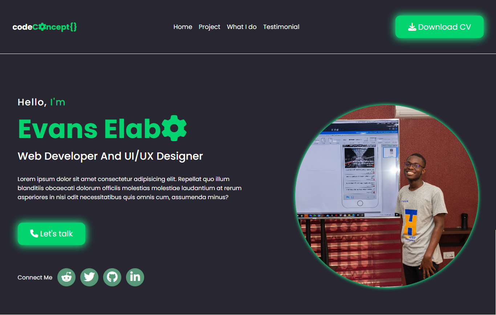
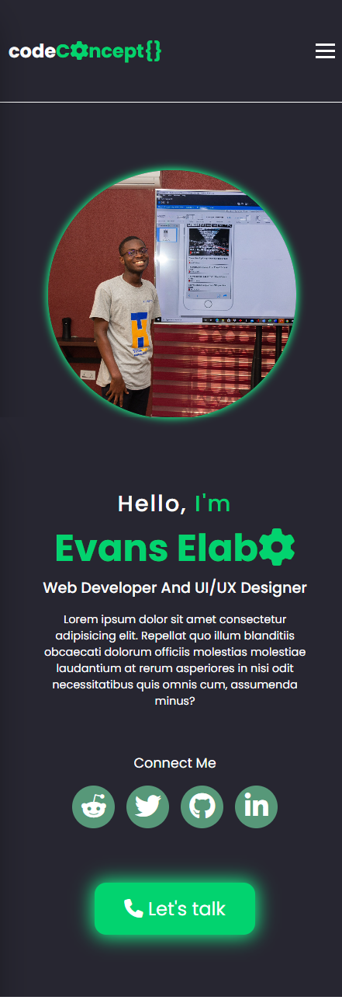
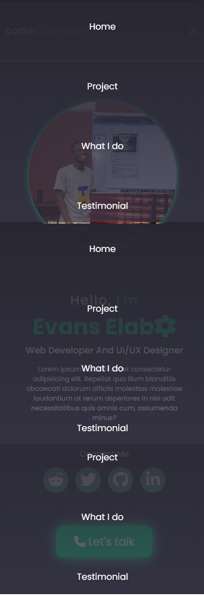

# Portfolio Website

This is a portfolio website which is going to be used to showcase my stack and many more.

## Table of contents

- [Overview](#overview)
  - [The challenge](#the-challenge)
  - [Screenshot](#screenshot)
  - [Links](#links)
- [My process](#my-process)
  - [Built with](#built-with)
  - [What I learned](#what-i-learned)
  - [Continued development](#continued-development)
  - [Useful resources](#useful-resources)
- [Author](#author)
- [Acknowledgments](#acknowledgments)

## Overview

### The Project

Users should be able to:

- View the optimal layout depending on their device's screen size

### Secreenshot

### Links

- Live Site URL: [codeConcept Website Preview](https://codeconcept.netlify.app)

- See Mockup 1: [CodeCocept Mockup Preview for mobile device](https://www.figma.com/proto/0BPMPqMGFH1Bj7QnlWPP2u/CodeConcept-Portfolio?node-id=44%3A1382&scaling=min-zoom&page-id=8%3A2944&starting-point-node-id=45%3A1595)

- See Mockup 2: [CodeCocept Mockup Preview for Desktop](https://www.figma.com/proto/0BPMPqMGFH1Bj7QnlWPP2u/CodeConcept-Portfolio?node-id=8%3A2946&scaling=min-zoom&page-id=8%3A2944&starting-point-node-id=45%3A1595)

## My Process

### Built With

- Semantic HTML5 markup
- CSS custom properties
- Flexbox
- JavaScript

### What I learned

1. Media Queries with CSS
2. Create Design Resonsiveness
3. Setting up the Mobilie menu with CSS
4. Making the mobile menu interactive with JavaScript

### Continued Development

I will continue to build more complex project to enhance my tech skill.

### Useful Resources

- [W3schools](https://www.w3schools.com) - This website helped me understand the basic use of Media Queries
- [Figma](https://figma.com) - I used Figma to design the website mock up.

## Connect Me

- Frontend Mentor - [@ellaboevans](https://www.frontendmentor.io/profile/ellaboevans)
- Twitter - [@theEvansElabo\_](https://www.twitter.com/theevanselabo_)
- LinkedIn - [@evans-elabo](https://www.linkedin.com/in/evans-elabo)
- Reddit - [@eelabo](https://www.reddit.com/user/eelabo)

## Acknowledgments

Thanks to [freeCodeCamp](https://www.freecodecamp.org) for the good work they have been doing for us. The courses treated there is worth it and really helpful. And thanks again to all content writers in the globe who are doing their best to support Junior Developers.
